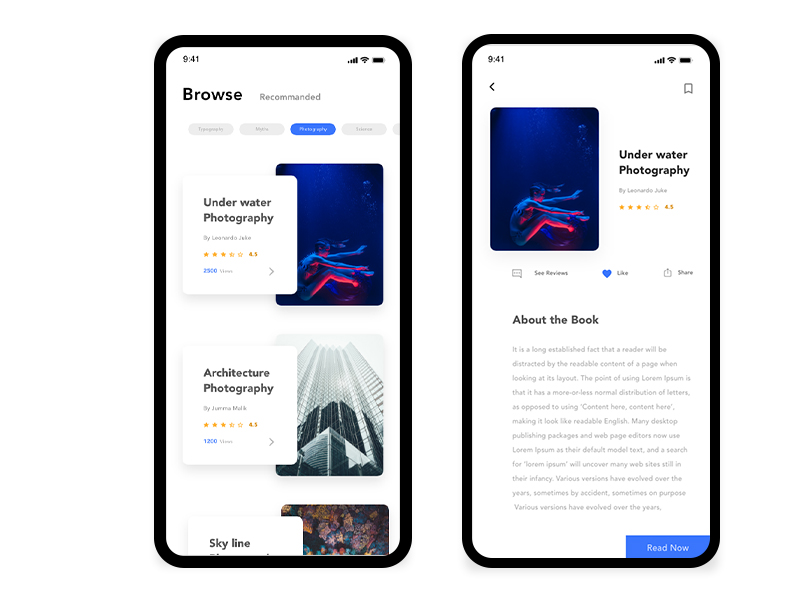
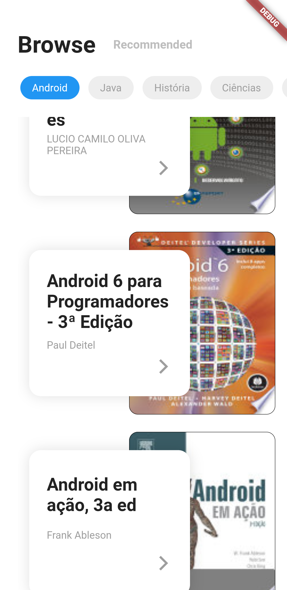

# Booksky by Pedro Massango
App for viewing and reading books using Flutter and the BLoC standard for project state management.

## Available in
> https://www.youtube.com/watch?v=oWmQ8fMLmaE&list=PLum90SMJW-vn-1p0JdIrTuZfjNqNT2V6E

## Design
> https://www.uplabs.com/posts/book-reading-app-design

## App

